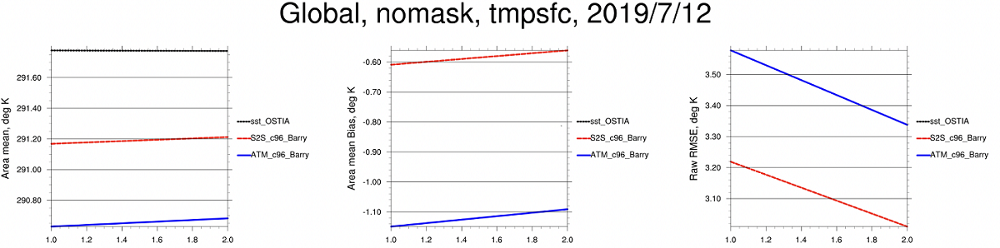

.. _BuildHTF:

=====================================
Building and Running the UFS-HTF
===================================== 

The Unified Forecast System (:term:`UFS`) Hierarchical Testing Framework (HTF) provides a platform for users to design/add/run their own testing cases. Once the HTF is built, users can follow the instruction/examples to configure and add test cases based on  the concept of HIERARCHICAL SYSTEM DEVELOPMENT (:term:`HSD`). 

This chapter walks users through how to build and run one of the test cases from `Case Studies for the UFS Weather Model <https://ufs-case-studies.readthedocs.io/en/develop/2019Barry.html>`__. 

.. attention::

   Currently The prototype of UFS-HTF is based on the `global-workflow <https://github.com/NOAA-EMC/global-workflow>`__, and it has been only tested on Orion. The steps described in this chapter will work only on Orion. This chapter can also serve as a starting point for running the UFS-HTF on other systems (including generic Linux/Mac systems), but the user will need to perform additional troubleshooting (e.g. installation of Spack-Stack, WIP). 

.. _HPCstackInfo:

Install the Spack-Stack
========================

.. Attention::
   Skip the Spack-Stack installation if working on a `Level 1 system <https://github.com/ufs-community/ufs-srweather-app/wiki/Supported-Platforms-and-Compilers>`_ (e.g. Orion).

Background
----------------

The UFS-HTF draws on over 50 code libraries to run its applications. These libraries range from libraries developed in-house at NOAA (e.g., NCEPLIBS, FMS) to libraries developed by NOAA's partners (e.g., PIO, ESMF) to truly third party libraries (e.g., NETCDF). Individual installation of these libraries is not practical, so the `Spack-Stack <https://github.com/NOAA-EMC/spack-stack>`__ was developed as a central installation system to ensure that the infrastructure environment across multiple platforms is as similar as possible. Installation of the Spack-Stack is required to run the UFS-HTF.

Instructions
-------------------------
For a detailed description of installation options, see `Installing the Spack-Stack <https://spack-stack.readthedocs.io/en/latest/>`__. 

After completing installation, continue to the next section (:numref:`Section %s: Download the UFS-HTF prototype <DownloadHTF>`). 

.. _DownloadHTF:

Download the UFS-HTF prototype
======================================
The UFS-HTF prototype source code is publicly available on GitHub. To download the HTF code, clone the ``doc`` branch of the repository:

.. code-block:: console

   git clone --recurse-submodules -b doc https://github.com/clouden90/ufs-htf.git

.. _CMakeHTF:

Build the UFS-HTF Using CMake
======================================
In the ``ufs-htf`` directory, create a subdirectory to hold the build's executables: 

.. code-block:: console

   cd ufs-htf
   mkdir build
   cd build

From the build directory, run the following commands to build the testing platform:

.. code-block:: console

   cmake ..
   make -j 2

.. _ExampleTestSet:

Example Test Cases
======================================
Insipred by `Case Studies for the UFS Weather Model <https://ufs-case-studies.readthedocs.io/en/develop/2019Barry.html>`__, we implemented one of the test cases (2019 Hurricane Barry) for ufs coupled model setup (S2S, S2SW, and S2SWA WIP). Currently the UFS-HTF supports nine tests as shown in :numref:`Table %s <HTFTestSet>`. Users who plan to design/add a new test should refer to :ref:`Adding test <AddTest>` for details on how to do so. At a minimum, these users will need to add the new test case to the ``ufs-htf/test/CMakeLists.txt`` script and add the corresponding files in the ``ufs-htf/test`` folder.

.. _HTFTestSet:

.. table::  Test Cases

   +----------------------+-------------------------+---------------------------------------------------------+
   | **Test Number**      | **Test Name**           | **Test Description**                                    |
   +======================+=========================+=========================================================+
   | Test #1              | build_ufs               | build ufs model and its utilities                       |
   +----------------------+-------------------------+---------------------------------------------------------+
   | Test #2              | get_ufs_fix_data        | stage model input data from AWS S3 bucket               |
   +----------------------+-------------------------+---------------------------------------------------------+
   | Test #3              | ATM_c96_Barry           | C96 grid atm only Hurricane Barry run                   |
   +----------------------+-------------------------+---------------------------------------------------------+
   | Test #4              | S2S_c96_Barry           | C96 grid atm-ocn-ice Hurricane Barry run                |
   +----------------------+-------------------------+---------------------------------------------------------+   
   | Test #5              | S2SW_c96_Barry          | C96 grid atm-ocn-ice-wav Hurricane Barry run            |
   +----------------------+-------------------------+---------------------------------------------------------+
   | Test #6              | S2SWA_c96_Barry         | C96 grid atm-ocn-ice-wav-aerosal Hurricane Barry run    |
   +----------------------+-------------------------+---------------------------------------------------------+
   | Test #7              | Barry_track_err         | Hurricane Barry track error check                       |
   +----------------------+-------------------------+---------------------------------------------------------+
   | Test #8              | model_vrfy              | Comparsion between fcst tmp2m/tmpsfc and reanalysis     |
   +----------------------+-------------------------+---------------------------------------------------------+
   | Test #9              | fcst_only_S2S_c96_Barry | Same as Test #4 without using Rocoto Workflow Manager   |
   +----------------------+-------------------------+---------------------------------------------------------+

.. _RunTestSet:

Running Test Cases
======================================
Following :numref:`Section %s <CMakeHTF>`, you can first check the list of test cases with:

.. code-block:: console

   cd <build-directory>/test
   ctest -N

This will list all available tests in the test suite:

.. code-block:: console     

   Test #1: build_ufs
   Test #2: get_ufs_fix_data
   Test #3: ATM_c96_Barry
   Test #4: S2S_c96_Barry
   Test #5: S2SW_c96_Barry
   Test #6: S2SWA_c96_Barry
   Test #7: Barry_track_err
   Test #8: model_vrfy
   Test #9: fcst_only_S2S_c96_Barry

Then you can run tests with:

.. code-block:: console

    ctest

This will run all tests in the test suite. This can take a while so be patient.  When the tests are complete, ctest will print out a summary. For example:

.. code-block:: console

    Test project /work2/noaa/epic-ps/ycteng/case/20220828/ufs-htf/build/test
        Start 1: build_ufs
    1/9 Test #1: build_ufs ........................   Passed  907.80 sec
        Start 2: get_ufs_fix_data
    2/9 Test #2: get_ufs_fix_data .................   Passed    0.08 sec
        Start 3: ATM_c96_Barry
    3/9 Test #3: ATM_c96_Barry ....................   Passed  1226.49 sec
        Start 4: S2S_c96_Barry
    4/9 Test #4: S2S_c96_Barry ....................   Passed  1273.41 sec
        Start 5: S2SW_c96_Barry
    5/9 Test #5: S2SW_c96_Barry ...................   Passed  1329.12 sec
        Start 6: S2SWA_c96_Barry
    6/9 Test #6: S2SWA_c96_Barry ..................   Passed  1771.19 sec
        Start 7: Barry_track_err
    7/9 Test #7: Barry_track_err ..................   Passed   28.91 sec
        Start 8: model_vrfy
    8/9 Test #8: model_vrfy .......................   Passed   66.50 sec
        Start 9: fcst_only_S2S_c96_Barry
    9/9 Test #9: fcst_only_S2S_c96_Barry ..........   Passed  821.40 sec

    100% tests passed, 0 tests failed out of 9

    Total Test time (real) = 7424.93 sec

If you want to run a single test or a subset of tests, you can do this with the :code:`-R` option, for example:

.. code-block:: console

   ctest -R S2S_c96_Barry # run a single test
   ctest -R S2S* # run a subset of tests

The output from these tests (stdout) will be printed to the screen but, to allow for greater scrutiny, it will also be written to the file **LastTest.log** in the directory :code:`<build-directory>/Testing/Temporary`.  In that same directory you will also find a file called **LastTestsFailed.log** that lists the last tests that failed.  This may be from the last time you ran ctest or, if all those tests passed, it may be from a previous invocation.

If you're not happy with the information in LastTest.log and you want to know more, you can ask ctest to be **verbose**

.. code-block:: console

   ctest -V -R S2S_c96_Barry

...or even **extra-verbose** (hypercaffeinated mode):

.. code-block:: console

   ctest -VV -R S2S_c96_Barry

The :code:`-V` and even :code:`-VV` display the output messages on the screen in addition to writing them to the LastTest.log file.  However, sometimes the amount of information written to LastTest.log isn't much different than if you were to run ctest without these options, particularly if all the tests pass.

You can also display the output messages only for the failed tests by using :code:`--output-on-failure`

.. code:: console

   ctest --output-on-failure

Then You can check error messages for the failed tests, figure out the issue and fix it.

**ctest** also has an option to only re-run the tests that failed last time:

.. code-block:: console

   ctest --rerun-failed

You can also check `<build-directory>/test/*.png` to examine the modeled results from test cases. Here is one of the example plots (surface temperature comparsion: atm-only vs s2s vs OSTIA) generated from test #7:

.. _TmpsfcS2S:

*Surface temperature timeseries comparison*
